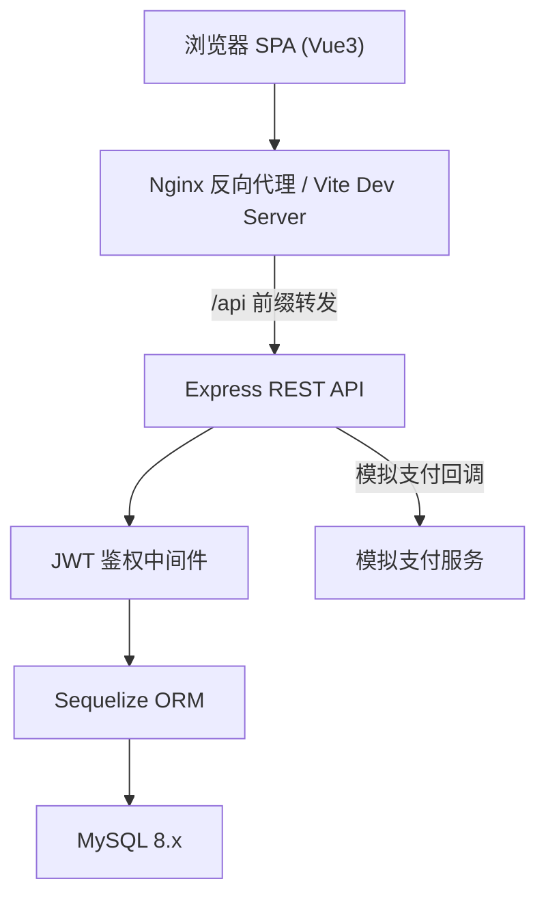
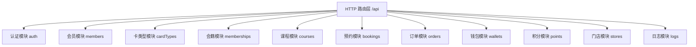
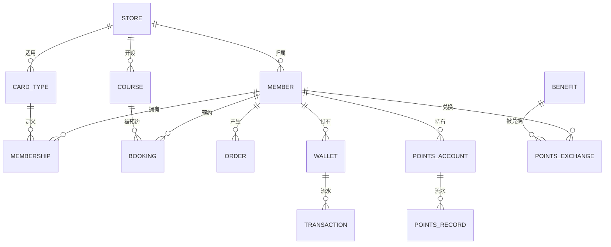

# 健身会员系统技术设计

Feature Name: fitness-membership-system
Updated: 2026-08-28

## 简介

本系统为健身场馆提供会员管理解决方案，覆盖会员管理、会籍/套餐、课程/预约、消费/支付、积分/权益、门店管理六大模块，支持多门店连锁运营。系统采用前后端分离架构。

## 架构

### 技术栈

| 层次 | 技术选型 | 说明 |
|------|---------|------|
| 前端 | Vue3 + Vite + TypeScript | 组合式 API 单页应用 |
| UI 组件 | Element Plus | 后台管理界面组件库 |
| 状态管理 | Pinia | 用户态与全局状态 |
| 路由 | Vue Router | 前端路由与权限守卫 |
| HTTP 客户端 | Axios | 请求封装与拦截器 |
| 后端 | Node.js + Express | RESTful API 服务 |
| ORM | Sequelize | 数据模型与迁移 |
| 数据库 | MySQL 8.x | 业务数据持久化 |
| 鉴权 | JWT | 无状态令牌认证 |

### 总体架构

### 后端模块划分

## 组件与接口

### RESTful API 概览

统一前缀 `/api`，请求/响应体为 JSON，鉴权使用 `Authorization: Bearer <token>`。

| 模块 | 方法 | 路径 | 说明 |
|------|------|------|------|
| 认证 | POST | `/api/auth/login` | 用户登录，签发 JWT |
| 认证 | GET | `/api/auth/profile` | 获取当前登录用户信息 |
| 门店 | GET/POST/PUT | `/api/stores` | 门店查询/创建/修改 |
| 会员 | GET/POST | `/api/members` | 会员列表/注册 |
| 会员 | GET/PUT | `/api/members/:id` | 会员详情/资料修改 |
| 卡类型 | GET/POST/PUT | `/api/card-types` | 卡类型管理 |
| 购卡 | POST | `/api/members/:id/cards` | 会员购卡，生成订单 |
| 会籍 | GET | `/api/members/:id/memberships` | 会员会籍列表 |
| 课程 | GET/POST | `/api/courses` | 课程列表/创建 |
| 预约 | POST | `/api/bookings` | 会员预约课程 |
| 预约 | GET | `/api/bookings` | 预约列表（按会员/门店/状态） |
| 预约 | PUT | `/api/bookings/:id/cancel` | 取消预约 |
| 预约 | PUT | `/api/bookings/:id/confirm` | 教练确认消课 |
| 充值 | POST | `/api/wallets/:memberId/recharge` | 余额充值（模拟支付） |
| 消费 | POST | `/api/wallets/:memberId/pay` | 余额消费扣款 |
| 账单 | GET | `/api/wallets/:memberId/transactions` | 流水明细 |
| 积分 | GET | `/api/points/:memberId` | 积分账户与明细 |
| 积分 | POST | `/api/points/:memberId/exchange` | 积分兑换权益 |
| 权益 | GET/POST/PUT | `/api/benefits` | 权益项目管理 |
| 日志 | GET | `/api/logs` | 操作日志查询 |

### 角色权限矩阵

| 接口范围 | 管理员 | 前台 | 教练 | 会员 |
|---------|:---:|:---:|:---:|:---:|
| 门店/卡类型/权益/积分规则管理 | Y | | | |
| 会员管理 | Y | Y | | |
| 购卡/充值/订单 | Y | Y | | 充值 |
| 课程创建 | Y | | Y | |
| 预约/取消 | Y | Y | Y | Y |
| 消课确认 | Y | | Y | |
| 账单/积分查询 | Y | Y | Y | 本人 |

## 数据模型

### 实体关系概览

### 核心表结构

**stores（门店）**

| 字段 | 类型 | 约束 | 说明 |
|------|------|------|------|
| id | BIGINT | PK, 自增 | 主键 |
| name | VARCHAR(100) | NOT NULL | 门店名称 |
| address | VARCHAR(255) | | 地址 |
| phone | VARCHAR(20) | | 联系电话 |
| business_hours | VARCHAR(100) | | 营业时间 |
| status | TINYINT | DEFAULT 1 | 1 启用 / 0 停用 |

**users（员工账号）**

| 字段 | 类型 | 约束 | 说明 |
|------|------|------|------|
| id | BIGINT | PK | 主键 |
| username | VARCHAR(50) | UNIQUE NOT NULL | 登录名 |
| password_hash | VARCHAR(255) | NOT NULL | BCrypt 哈希 |
| name | VARCHAR(50) | NOT NULL | 姓名 |
| role | ENUM(admin, frontdesk, trainer) | NOT NULL | 角色 |
| store_id | BIGINT | FK → stores | 所属门店 |
| status | TINYINT | DEFAULT 1 | 启用状态 |
| failed_attempts | INT | DEFAULT 0 | 连续失败次数 |
| locked_until | DATETIME | NULL | 锁定截止时间 |

**members（会员）**

| 字段 | 类型 | 约束 | 说明 |
|------|------|------|------|
| id | BIGINT | PK | 主键 |
| member_no | VARCHAR(20) | UNIQUE NOT NULL | 会员编号 |
| name | VARCHAR(50) | NOT NULL | 姓名 |
| phone | VARCHAR(20) | UNIQUE NOT NULL | 手机号 |
| gender | TINYINT | | 性别 |
| birthday | DATE | | 生日 |
| id_card | VARCHAR(18) | | 身份证号 |
| emergency_contact | VARCHAR(50) | | 紧急联系人 |
| emergency_phone | VARCHAR(20) | | 紧急联系电话 |
| store_id | BIGINT | FK → stores | 归属门店 |
| status | TINYINT | DEFAULT 1 | 1 正常 / 0 停用 |
| created_at | DATETIME | | 创建时间 |

**card_types（会员卡类型）**

| 字段 | 类型 | 约束 | 说明 |
|------|------|------|------|
| id | BIGINT | PK | 主键 |
| name | VARCHAR(50) | NOT NULL | 卡名 |
| duration_days | INT | NOT NULL | 有效期天数 |
| price | DECIMAL(10,2) | NOT NULL | 价格 |
| status | TINYINT | DEFAULT 1 | 1 在售 / 0 下架 |
| benefits_desc | TEXT | | 权益说明 |

**memberships（会籍）**

| 字段 | 类型 | 约束 | 说明 |
|------|------|------|------|
| id | BIGINT | PK | 主键 |
| member_id | BIGINT | FK → members | 会员 |
| card_type_id | BIGINT | FK → card_types | 卡类型 |
| store_id | BIGINT | FK → stores | 购买门店 |
| start_date | DATE | NOT NULL | 起始日期 |
| end_date | DATE | NOT NULL | 截止日期 |
| status | ENUM(active, expired, frozen) | NOT NULL | 状态 |

**courses（课程）**

| 字段 | 类型 | 约束 | 说明 |
|------|------|------|------|
| id | BIGINT | PK | 主键 |
| name | VARCHAR(100) | NOT NULL | 课程名 |
| type | ENUM(group, private) | NOT NULL | 团体课/私教课 |
| trainer_id | BIGINT | FK → users | 教练 |
| store_id | BIGINT | FK → stores | 门店 |
| duration_minutes | INT | NOT NULL | 时长 |
| capacity | INT | | 容量（团体课） |
| start_time | DATETIME | NOT NULL | 上课时间 |
| price | DECIMAL(10,2) | | 私教课价格 |
| status | ENUM(open, full, closed) | | 状态 |

**bookings（预约）**

| 字段 | 类型 | 约束 | 说明 |
|------|------|------|------|
| id | BIGINT | PK | 主键 |
| member_id | BIGINT | FK → members | 会员 |
| course_id | BIGINT | FK → courses | 课程 |
| status | ENUM(booked, completed, cancelled, waiting) | NOT NULL | 状态 |
| booked_at | DATETIME | NOT NULL | 预约时间 |
| cancelled_at | DATETIME | | 取消时间 |

**orders（订单）**

| 字段 | 类型 | 约束 | 说明 |
|------|------|------|------|
| id | BIGINT | PK | 主键 |
| order_no | VARCHAR(30) | UNIQUE NOT NULL | 订单号 |
| member_id | BIGINT | FK → members | 会员 |
| type | ENUM(recharge, card, course) | NOT NULL | 订单类型 |
| amount | DECIMAL(10,2) | NOT NULL | 金额 |
| pay_method | ENUM(cash, wechat, alipay) | | 支付方式 |
| status | ENUM(pending, paid, cancelled) | NOT NULL | 状态 |
| store_id | BIGINT | FK → stores | 门店 |

**wallets（钱包）**

| 字段 | 类型 | 约束 | 说明 |
|------|------|------|------|
| id | BIGINT | PK | 主键 |
| member_id | BIGINT | UNIQUE FK → members | 会员 |
| balance | DECIMAL(12,2) | DEFAULT 0 | 余额 |

**transactions（资金流水）**

| 字段 | 类型 | 约束 | 说明 |
|------|------|------|------|
| id | BIGINT | PK | 主键 |
| member_id | BIGINT | FK → members | 会员 |
| wallet_id | BIGINT | FK → wallets | 钱包 |
| type | ENUM(recharge, consume, refund) | NOT NULL | 流水类型 |
| amount | DECIMAL(10,2) | NOT NULL | 金额（正负） |
| order_id | BIGINT | FK → orders | 关联订单 |
| created_at | DATETIME | | 时间 |

**points_accounts（积分账户）**

| 字段 | 类型 | 约束 | 说明 |
|------|------|------|------|
| id | BIGINT | PK | 主键 |
| member_id | BIGINT | UNIQUE FK → members | 会员 |
| balance | INT | DEFAULT 0 | 积分余额 |

**points_records（积分流水）**

| 字段 | 类型 | 约束 | 说明 |
|------|------|------|------|
| id | BIGINT | PK | 主键 |
| member_id | BIGINT | FK → members | 会员 |
| type | ENUM(earn, spend, expire) | NOT NULL | 积分类型 |
| points | INT | NOT NULL | 变动值（正负） |
| order_id | BIGINT | FK → orders | 关联订单 |
| created_at | DATETIME | | 时间 |

**benefits（权益项目）**

| 字段 | 类型 | 约束 | 说明 |
|------|------|------|------|
| id | BIGINT | PK | 主键 |
| name | VARCHAR(100) | NOT NULL | 权益名 |
| points_cost | INT | NOT NULL | 所需积分 |
| type | ENUM(coupon, trial, test) | NOT NULL | 类型 |
| status | TINYINT | DEFAULT 1 | 启用状态 |

**point_exchanges（积分兑换）**

| 字段 | 类型 | 约束 | 说明 |
|------|------|------|------|
| id | BIGINT | PK | 主键 |
| member_id | BIGINT | FK → members | 会员 |
| benefit_id | BIGINT | FK → benefits | 权益 |
| points_cost | INT | NOT NULL | 消耗积分 |
| status | ENUM(completed, used) | | 状态 |
| created_at | DATETIME | | 时间 |

**operation_logs（操作日志）**

| 字段 | 类型 | 约束 | 说明 |
|------|------|------|------|
| id | BIGINT | PK | 主键 |
| user_id | BIGINT | FK → users | 操作人 |
| action | VARCHAR(100) | NOT NULL | 动作 |
| detail | TEXT | | 详情 |
| created_at | DATETIME | | 时间 |

## 正确性属性（不变量）

1. **余额非负**：钱包余额在任何时点不得小于 0；扣款前校验并在数据库事务中锁定钱包行
2. **积分非负**：积分账户余额不得小于 0；兑换前校验
3. **会籍唯一性**：同一会员同一卡类型的有效会籍最多一条
4. **会籍时间连续**：续费顺延时截止日期 = MAX(原截止日期, 今天) + 新时长
5. **预约名额约束**：课程已预约人数 ≤ capacity；名额释放通过事务内计数更新实现
6. **预约时间冲突**：同一会员同一时段只能有一笔有效预约（booked）
7. **资金流水一致**：每次余额变更必须有且仅有一条对应流水记录，且与余额变更在同一事务中提交
8. **积分与消费联动**：每笔消费在同一事务中完成扣款、流水记录与积分累计

## 错误处理

| 场景 | HTTP 状态 | 响应结构 |
|------|:---:|------|
| 参数校验失败 | 400 | `{ code, message, errors }` |
| 未认证 | 401 | `{ code: 'UNAUTHORIZED', message }` |
| 权限不足 | 403 | `{ code: 'FORBIDDEN', message }` |
| 资源不存在 | 404 | `{ code: 'NOT_FOUND', message }` |
| 业务规则冲突（余额不足/名额已满/时间冲突/手机号重复） | 409 | `{ code, message }` |
| 账号锁定 | 423 | `{ code: 'ACCOUNT_LOCKED', message, lockedUntil }` |
| 服务端异常 | 500 | `{ code: 'INTERNAL_ERROR', message }` |

- 统一错误中间件捕获异常并格式化响应
- Sequelize 数据库异常映射为 400/409 或 500
- 前端 Axios 拦截器统一处理错误提示与 401 跳转登录

## 测试策略

### 单元测试（后端）
- 业务规则测试：购卡顺延、余额校验、名额与时间冲突、积分兑换
- 使用 Vitest + Supertest 对 Express 路由与 service 层测试
- 关键不变量每项至少一个正向与一个反向用例

### 集成测试（后端）
- 使用独立测试数据库，测试完整业务流程：注册 → 购卡 → 支付 → 预约 → 消课 → 消费 → 积分兑换
- 订单支付回调流程测试

### 前端测试
- 核心业务组件（会员表单、购卡、预约）使用 Vue Test Utils
- 路由守卫与权限渲染测试

### 端到端
- 手动验证脚本覆盖六大模块主流程

## 参考

- 需求文档：`.monkeycode/specs/fitness-membership-system/requirements.md`
